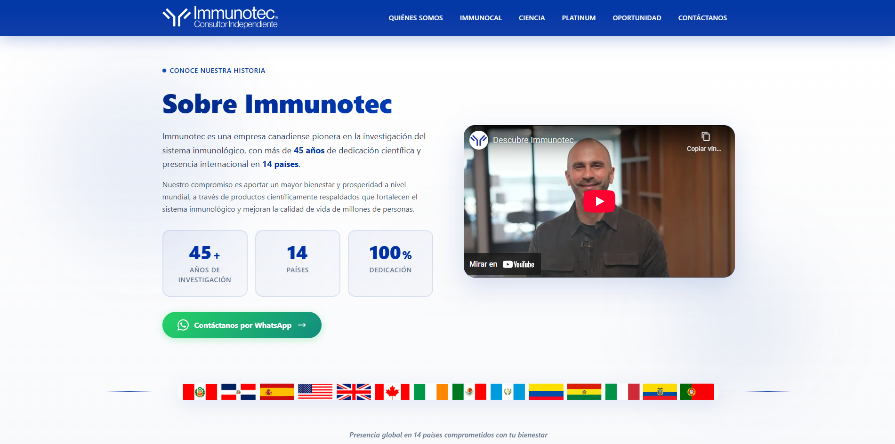

# Immunocal Landing Page


## 🚀 Demo en Vivo

**[Ver Proyecto en Vivo →](https://immuno-page.vercel.app/)**



---

Landing page profesional desarrollado con **Angular 20** y **Server-Side Rendering (SSR)** para la promoción de productos Immunocal/Immunotec. Este proyecto demuestra habilidades en desarrollo frontend moderno, optimización SEO y integración con servicios externos.

## Descripción

Landing page de una sola página (SPA) con múltiples secciones diseñada para presentar productos de suplementos naturales Immunocal, enfocado en el fortalecimiento del sistema inmunológico a través del glutatión. La página incluye información detallada sobre productos, oportunidades de negocio y un formulario de contacto integrado con **n8n** para automatización de flujos de trabajo.

### Características Principales

- **SEO Optimizado**: Meta tags, Open Graph, y meta descriptions para mejor posicionamiento
- **Server-Side Rendering (SSR)**: Mejora el rendimiento y SEO con Angular Universal
- **Formulario de Contacto Avanzado**: Validaciones reactivas con integración n8n webhook
- **Seguridad**: Implementación de Google reCAPTCHA v3 para protección anti-spam
- **Responsive Design**: Diseño adaptable usando TailwindCSS 4
- **Internacionalización**: Soporte multi-país con códigos de teléfono localizados
- **Animaciones**: Efectos de scroll y animaciones de entrada de secciones
- **Arquitectura Modular**: Organización por features y componentes reutilizables

## Tecnologías Utilizadas

### Core

- **Angular 20.1** - Framework frontend con Standalone Components
- **TypeScript 5.8** - Tipado estático y desarrollo robusto
- **RxJS 7.8** - Programación reactiva y manejo de estados

### Estilos

- **TailwindCSS 4.1** - Framework CSS utility-first
- **SCSS** - Preprocesador CSS para estilos personalizados

### Servicios e Integraciones

- **n8n** - Automatización de flujos de trabajo mediante webhooks
- **Google reCAPTCHA v3** - Protección contra spam y bots
- **Angular SSR** - Renderizado del lado del servidor con Express

### DevOps & Tooling

- **Angular CLI 20.1** - Herramientas de desarrollo y build
- **@ngx-env/builder** - Manejo de variables de entorno
- **Karma + Jasmine** - Testing framework
- **Prettier** - Formateo de código

## Estructura del Proyecto

```
immunocal-landing/
├── src/
│   ├── app/
│   │   ├── core/                    # Componentes compartidos
│   │   │   └── components/
│   │   │       ├── navbar/          # Navegación principal
│   │   │       └── footer/          # Pie de página
│   │   ├── features/                # Features modulares
│   │   │   └── landing/
│   │   │       ├── sections/        # Secciones del landing
│   │   │       │   ├── hero-video/
│   │   │       │   ├── sobre-immunotec/
│   │   │       │   ├── contacto/    # Formulario con n8n
│   │   │       │   ├── glutation/
│   │   │       │   ├── platinum/
│   │   │       │   ├── omega-genv/
│   │   │       │   ├── sport/
│   │   │       │   ├── optimizer/
│   │   │       │   └── knutric/
│   │   │       └── landing.ts
│   │   ├── app.config.ts            # Configuración de la app
│   │   ├── app.config.server.ts     # Configuración SSR
│   │   └── app.ts                   # Componente raíz
│   └── index.html
├── .env.example                      # Variables de entorno de ejemplo
├── package.json
└── README.md
```

## Variables de Entorno

El proyecto utiliza variables de entorno para configuraciones sensibles. Crea un archivo `.env` basado en `.env.example`:

```bash
# WhatsApp Business Number
NG_APP_WHATSAPP_NUMBER=51999999999

# Client Identification
NG_APP_CLIENTE=your-client-id

# n8n Webhook URL
NG_APP_N8N_WEBHOOK=https://your-n8n-instance.com/webhook/contacto
```

### Descripción de Variables

| Variable                 | Descripción                                        | Ejemplo                                    |
| ------------------------ | -------------------------------------------------- | ------------------------------------------ |
| `NG_APP_WHATSAPP_NUMBER` | Número de WhatsApp para contacto directo           | `51999999999`                              |
| `NG_APP_CLIENTE`         | Identificador único del cliente                    | `immunocal-peru`                           |
| `NG_APP_N8N_WEBHOOK`     | URL del webhook de n8n para formulario de contacto | `https://n8n.example.com/webhook/contacto` |

## Instalación

### Prerrequisitos

- Node.js 18+ y npm 9+
- Angular CLI 20+

### Pasos de Instalación

1. **Clonar el repositorio**

```bash
git clone https://github.com/your-username/immunocal-landing.git
cd immunocal-landing
```

2. **Instalar dependencias**

```bash
npm install
```

3. **Configurar variables de entorno**

```bash
cp .env.example .env
# Edita .env con tus credenciales
```

4. **Iniciar servidor de desarrollo**

```bash
npm start
# o
ng serve
```

La aplicación estará disponible en `http://localhost:4200/`

## Scripts Disponibles

```bash
# Desarrollo
npm start                        # Inicia servidor de desarrollo
ng serve                         # Alias de npm start

# Build
npm run build                    # Build de producción
ng build                         # Build con configuración por defecto
npm run watch                    # Build en modo watch para desarrollo

# Testing
npm test                         # Ejecuta tests unitarios con Karma
ng test                          # Alias de npm test

# SSR
npm run serve:ssr:immunocal-landing  # Sirve la aplicación con SSR
```

## Integración con n8n

El formulario de contacto está integrado con **n8n** (herramienta de automatización de workflows) a través de webhooks.

### Flujo de Datos

1. Usuario completa el formulario de contacto
2. Se valida con Google reCAPTCHA v3
3. Los datos se envían al webhook de n8n configurado
4. n8n procesa los datos (puede enviar emails, almacenar en DB, notificar en Slack, etc.)
5. Se muestra mensaje de confirmación al usuario

### Estructura de Datos Enviados

```typescript
{
  nombre: string,
  correo: string,
  celular: string,        // Con código de país incluido
  mensaje: string,
  cliente: string,        // De variable de entorno
  fechaContacto: string,  // ISO 8601
  fuente: "landing-page-contacto",
  recaptcha: string       // Token de reCAPTCHA v3
}
```

### Configuración de n8n (ejemplo)

Puedes crear un workflow en n8n que:

- Reciba el webhook
- Valide el token de reCAPTCHA
- Envíe un email al equipo de ventas
- Registre el contacto en un CRM (HubSpot, Salesforce, etc.)
- Envíe notificación a Slack/Discord
- Almacene en base de datos

## SEO y Optimizaciones

### Meta Tags Implementados

```typescript
- Title: "Immunocal | Suplemento Natural para tu Bienestar"
- Description: SEO optimizada
- Keywords: immunocal, glutatión, sistema inmunológico, etc.
- Open Graph (og:title, og:description, og:image)
- Theme Color: #0132A3
```

### Optimizaciones de Rendimiento

- **Server-Side Rendering (SSR)**: Primera carga más rápida y mejor indexación
- **Lazy Loading**: Componentes cargados bajo demanda
- **Optimización de imágenes**: Compresión y formatos modernos
- **Tree Shaking**: Eliminación de código no utilizado
- **Minificación**: HTML, CSS y JS minificados en producción

## Secciones del Landing

1. **Hero Video** - Video de presentación con control de volumen
2. **Sobre Immunotec** - Información corporativa
3. **Asóciate** - Call to action para asociados
4. **Video Informativo** - Contenido educativo
5. **Galería de Imágenes** - Showcase visual
6. **Fortalece tu Sistema** - Beneficios del producto
7. **La Ciencia Detrás** - Respaldo científico
8. **Glutatión** - Información del componente principal
9. **Productos**: Platinum, Omega Genv, Sport, Optimizer, Knutric
10. **Oportunidades de Negocio** - MLM/Multinivel
11. **Contacto** - Formulario integrado con n8n

## Build para Producción

```bash
# Build estándar
ng build

# Build con SSR
ng build && npm run serve:ssr:immunocal-landing
```

Los archivos de producción se generan en `dist/immunocal-landing/`.

### Deployment

El proyecto es compatible con:

- **Vercel** - Deployment automático con Git
- **Netlify** - Con soporte para Angular SSR
- **AWS Amplify**
- **Firebase Hosting**
- **Servidor propio** con Node.js/Express

## Portfolio

Este proyecto fue desarrollado como parte de mi portfolio profesional para demostrar:

- Desarrollo con Angular moderno (versión 20 con Standalone Components)
- Implementación de SSR para optimización SEO
- Integración con servicios externos (n8n, reCAPTCHA)
- Arquitectura limpia y escalable
- Diseño responsive con TailwindCSS
- Manejo de formularios reactivos y validaciones
- Seguridad web (CAPTCHA, validaciones, sanitización)

## Autor

**Erick** - Desarrollador Full Stack

## Notas Adicionales

- El proyecto usa **Standalone Components** de Angular (sin módulos NgModule)
- Implementa **Signals** para manejo de estado reactivo
- Código estrictamente tipado con TypeScript
- Hooks de commit y pre-commit disponibles
- Prettier configurado para mantener consistencia de código

## Recursos

- [Documentación de Angular](https://angular.dev)
- [TailwindCSS Docs](https://tailwindcss.com)
- [n8n Documentation](https://docs.n8n.io)
- [Google reCAPTCHA v3](https://developers.google.com/recaptcha/docs/v3)

---

**Nota**: Este es un proyecto de portfolio. Las credenciales de producción no están incluidas en el repositorio por razones de seguridad.
